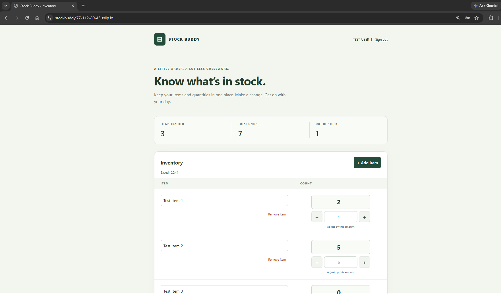
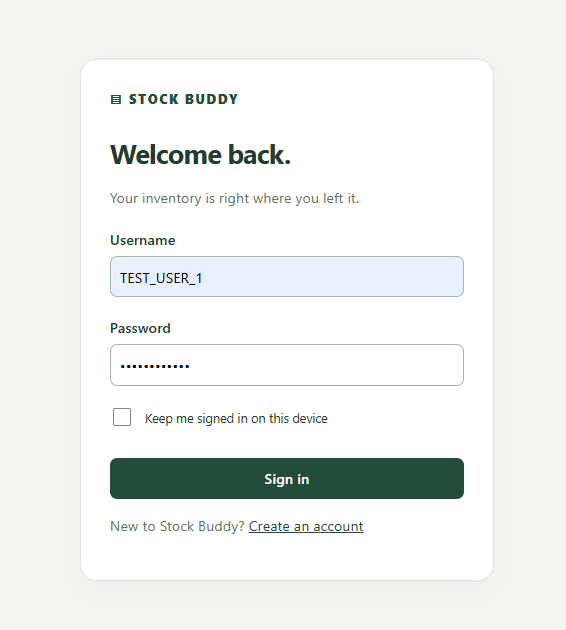

# Stock Buddy

[](https://github.com/Lozo214/StockBuddy/actions/workflows/ci.yml)

Stock Buddy is a mobile-friendly inventory tracker built with C# and Blazor. Each user has a private inventory and can add items, edit quantities, or make quick count adjustments. Changes are saved automatically.

**Live demo:** [stockbuddy.77-112-80-43.sslip.io](https://stockbuddy.77-112-80-43.sslip.io)

## Screenshots

### Inventory



### Sign in



## Highlights

- User registration and sign-in with ASP.NET Core Identity
- Separate, private inventory for each account
- Automatic saving when a field loses focus
- Quick addition and subtraction controls for item counts
- Responsive layout designed for desktop and mobile use
- Input validation, deletion confirmation, and clear save/error feedback
- Optimistic concurrency protection against conflicting edits from multiple tabs
- Persistent SQLite storage across application restarts
- Automated integration and service tests
- HTTPS deployment on AWS

## Technology

- .NET 10 and ASP.NET Core
- Blazor Interactive Server
- Entity Framework Core
- SQLite
- ASP.NET Core Identity
- xUnit
- Docker and Caddy
- Amazon EC2 and encrypted EBS storage
- GitHub Actions

## Architecture

```text
Browser
  → Blazor components
  → Inventory service
  → Entity Framework Core
  → SQLite
```

The UI delegates inventory operations to a service layer. Each database operation uses a fresh Entity Framework context, and ownership checks are applied to every inventory read and write. Version tokens prevent stale pages from silently overwriting newer changes.

## Run locally

Install the [.NET 10 SDK](https://dotnet.microsoft.com/download/dotnet/10.0), clone this repository, and run:

```powershell
dotnet run --project src/StockBuddy.Web -- --urls http://localhost:5265
```

Open [http://localhost:5265](http://localhost:5265) and create an account. The application creates its local SQLite databases automatically.

To run with Docker instead:

```powershell
docker compose up --build -d
```

Then open [http://localhost:8080](http://localhost:8080).

## Test

```powershell
dotnet test StockBuddy.slnx -c Release
```

The test suite covers inventory persistence, account isolation, authentication, validation, concurrency conflicts, CSRF protection, login lockout, and session revocation.

GitHub Actions restores, builds, tests, and creates a publishable application on every push and pull request.

## Deployment

The live application runs in Docker on an Amazon EC2 instance behind Caddy, which provides HTTPS and reverse proxying. Application data and encryption keys are stored on an encrypted, persistent EBS volume.

Deployment details are available in [docs/DEPLOYMENT.md](docs/DEPLOYMENT.md). Resume-ready project wording is available in [docs/RESUME.md](docs/RESUME.md).

## Current scope

Stock Buddy is designed as a single-instance portfolio project. It does not currently include email verification, password recovery, multi-factor authentication, offline editing, or multi-instance database scaling.
